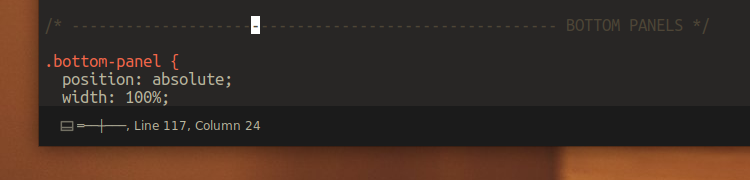

# Ruler Proximity Indicator

This plugin shows in the status bar how far the selected line last character is from a ruler. If multiple rulers are defined in your settings, the indicator uses the closest as reference.

## Installation

RulerProximityIndicator is available via [Package Control](https://packagecontrol.io), which is the easiest way to install it. Alternatively, you can download this repository and place it in your *Packages* directory.

## Usage

Helps to write "code separation" comments when the gutter and the rulers are disabled.

**Examples:**

The last character is away from the ruler, on the left.

The last character is 2 columns away from the ruler, on the right.

The last character is right on the ruler's column.

